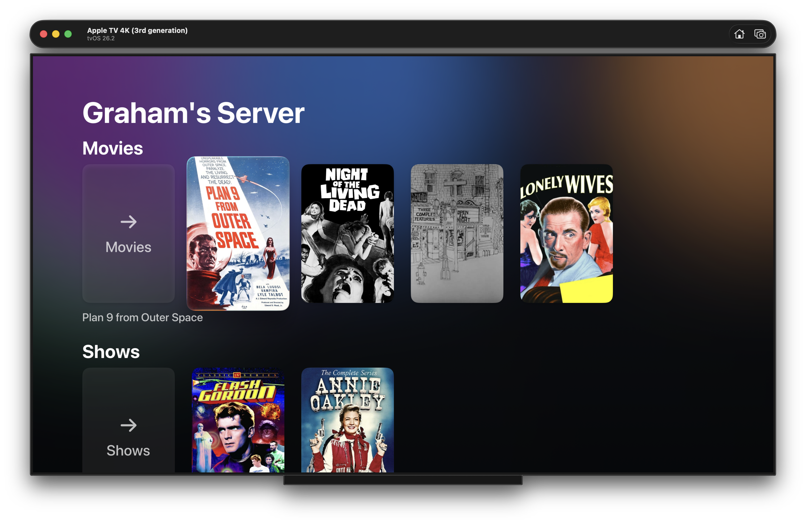

# Freya Player

Freya Player is a native Apple tvOS, iOS, and Mac app for watching video from Jellyfin or Plex, designed to feel as close to a stock Apple experience as possible.

  

  

## Contributing

Issues and PRs welcome.

Tools:

- `mise test` – run the complete web, deployment, shared-gem, and portable Apple logic test suite
- `mise simulate iphone|ipad|macos|tv` – build and launch one Apple target
- `mise xcode` – open the project in Xcode
- `$publish` – version, test, push, archive, upload, and submit every configured Apple target

## License

MIT
